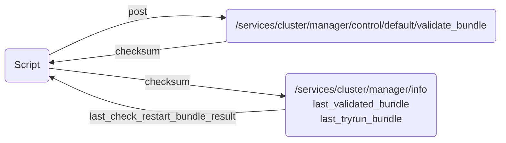

# last_check_restart_bundle_result returns an asynchronous result

This repo should demonstrate an issue we have with Splunk REST API. We are trying to validate a clusterbundle on cluster manager and check
if it's needs a restart or not. Unfurtunatly the property telling us if we need to restart seems to be changing over time.




We send a POST request to `/services/cluster/manager/control/default/validate_bundle` and receive a `checksum` if a new cluster bundle is available.  
We then compare this against the `/services/cluster/manager/info` endpoint by checking whether the bundle has already been validated (`last_validated_bundle.checksum`) and whether a dry run has been performed (`last_dry_run_bundle.checksum`).

When we know that a cluster restart is required — for example, when changing the `homePath` of an existing index — we observe that the `last_check_restart_bundle_result` value changes over time.  
In lab environments, this process only takes a few seconds, but we are uncertain how it behaves across various production environments.

## steps to reproduce

These steps create a Splunk index cluster in a containerized environment, then create an index and modify its settings in a way that requires a restart of the cluster peers.

### start aws instance as a container host ##

```bash
aws ec2 run-instances --cli-input-yaml file://demohost-aws/demohost.yml --user-data file://demohost-aws/demohost-cloudinit.yml --output yaml
```

- ssh into the instance and clone repo

```bash
git clone https://github.com/schose/splunk_rest_case.git
cd splunk_rest_case
docker-compose up -d
```

- wait for the cluster to come up


- copy apps/testapp/indexes.conf to managerapps

```bash
docker cp apps/testapp/default/indexes.conf splunk_rest_case_clm_1:/opt/splunk/etc/manager-apps/_cluster/local/
```

- run validation

```bash
python3 scripts/testvalidation.py localhost:8002
```
There will be no need to restart the cluster

- apply cluster bundle
```bash
docker exec -ti splunk_rest_case_clm_1 sudo -u splunk /opt/splunk/bin/splunk apply cluster-bundle -auth admin:Password01
```

- wait for cluster bundle to be applied

```bash
docker exec -ti splunk_rest_case_clm_1 sudo -u splunk /opt/splunk/bin/splunk show cluster-bundle-status -auth admin:Password01
```

- change homepath of index test1 in apps/testapp/default/indexes.conf - this will enforce a restart of the cluster peers
```bash
sed -i 's|\(homePath.*\)|\11|' apps/testapp/default/indexes.conf
```

- copy apps/testapp/indexes.conf to managerapps

```bash
docker cp apps/testapp/default/indexes.conf splunk_rest_case_clm_1:/opt/splunk/etc/manager-apps/_cluster/local/
```

- run validation

```bash
python3 scripts/testvalidation.py localhost:8002
```

output will be something like this:

```bash
[ec2-user@ip-172-31-17-29 splunk_rest_case]$ python3 scripts/testvalidation.py localhost:8002
Validating bundle...
Bundle checksum: A83F8C3C1139EA6AFCFD6CAC4B01B260
Waiting for bundle to be validated...
Attempt 1/10 - Validated checksum: A83F8C3C1139EA6AFCFD6CAC4B01B260, Dry run checksum: A83F8C3C1139EA6AFCFD6CAC4B01B260, last_check_restart_bundle_result: False
Attempt 2/10 - Validated checksum: A83F8C3C1139EA6AFCFD6CAC4B01B260, Dry run checksum: A83F8C3C1139EA6AFCFD6CAC4B01B260, last_check_restart_bundle_result: False
Attempt 3/10 - Validated checksum: A83F8C3C1139EA6AFCFD6CAC4B01B260, Dry run checksum: A83F8C3C1139EA6AFCFD6CAC4B01B260, last_check_restart_bundle_result: False
Attempt 4/10 - Validated checksum: A83F8C3C1139EA6AFCFD6CAC4B01B260, Dry run checksum: A83F8C3C1139EA6AFCFD6CAC4B01B260, last_check_restart_bundle_result: True
Attempt 5/10 - Validated checksum: A83F8C3C1139EA6AFCFD6CAC4B01B260, Dry run checksum: A83F8C3C1139EA6AFCFD6CAC4B01B260, last_check_restart_bundle_result: True
Attempt 6/10 - Validated checksum: A83F8C3C1139EA6AFCFD6CAC4B01B260, Dry run checksum: A83F8C3C1139EA6AFCFD6CAC4B01B260, last_check_restart_bundle_result: True
Attempt 7/10 - Validated checksum: A83F8C3C1139EA6AFCFD6CAC4B01B260, Dry run checksum: A83F8C3C1139EA6AFCFD6CAC4B01B260, last_check_restart_bundle_result: True
Attempt 8/10 - Validated checksum: A83F8C3C1139EA6AFCFD6CAC4B01B260, Dry run checksum: A83F8C3C1139EA6AFCFD6CAC4B01B260, last_check_restart_bundle_result: True
Attempt 9/10 - Validated checksum: A83F8C3C1139EA6AFCFD6CAC4B01B260, Dry run checksum: A83F8C3C1139EA6AFCFD6CAC4B01B260, last_check_restart_bundle_result: True
Attempt 10/10 - Validated checksum: A83F8C3C1139EA6AFCFD6CAC4B01B260, Dry run checksum: A83F8C3C1139EA6AFCFD6CAC4B01B260, last_check_restart_bundle_result: True

```

