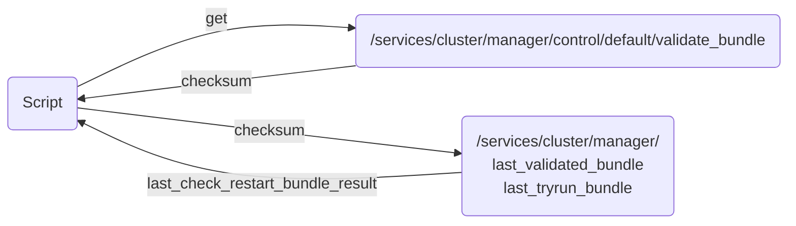

```mermaid

flowchart LR
        A(["Script"])
        A --get--> B("/services/cluster/manager/control/default/validate_bundle")
        B --checksum--> A("Script")
        A --checksum--> C("/services/cluster/manager/<br>last_validated_bundle<br>last_tryrun_bundle")
        C --last_check_restart_bundle_result--> A
```

